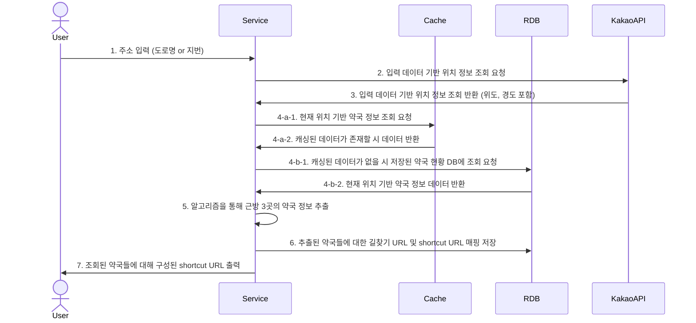
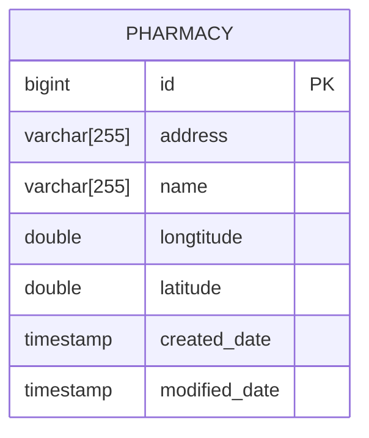

# pharmacy-explorer

> 특정 위치에서 가까운 약국 탐색기 서비스

# 요구사항

약국 찾기 서비스 요구사항

- 위도, 경도가 포함된 약국 현황 데이터를 기반으로 주소 정보를 입력 시 해당 데이터 기반 가까운 3곳의 정보를 반환한다.
    - 입력 데이터인 주소는 도로명주소 혹은 지번주소로 한다.
        - 데이터 입력 시 [카카오 우편번호 서비스](https://postcode.map.daum.net/guide)를 이용할 예정이다.
        - 동, 호수는 불필요하니 지번, 혹은 도로명까지만 입력한다.
    - 가까운 3곳에 대한 정보 추출 시 아래의 방법으로 구분한다.
        - 구체의 두 점 사이의 거리 관련 알고리즘 ([Haversine Formula](https://en.wikipedia.org/wiki/Haversine_formula))
        - 반경 10km 내에 없을 경우 아무것도 반환하지 않는다.
        - 추출한 약국 정보에 대한 길안내 URL을 반환한다
            - URL 가독성을 위해 shortcut url 활용 예정

# 수행 흐름

# 프로젝트 구성 항목

- Java 11
- Spring boot 2.7.16
- Spring boot JPA
- Spring boot Web
- Spring boot Devtools
- Spring boot Configuration Processor
- Lombok
- h2
- mariaDB

# ERD

