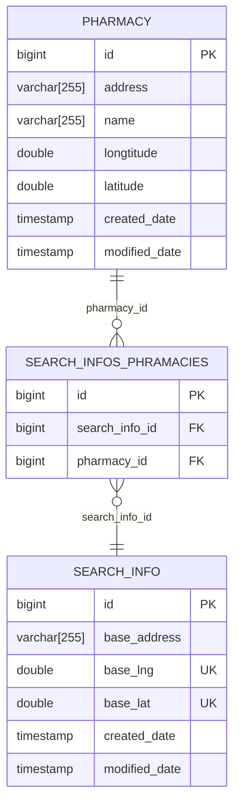

# pharmacy-explorer

> 특정 위치에서 가까운 약국 탐색기 서비스

# 요구사항

약국 찾기 서비스 요구사항

- 위도, 경도가 포함된 약국 현황 데이터를 기반으로 주소 정보를 입력 시 해당 데이터 기반 가까운 3곳의 정보를 반환한다.
    - 입력 데이터인 주소는 도로명주소 혹은 지번주소로 한다.
        - 데이터 입력 시 [카카오 우편번호 서비스](https://postcode.map.daum.net/guide)를 이용할 예정이다.
        - 동, 호수는 불필요하니 지번, 혹은 도로명까지만 입력한다.
    - 가까운 3곳에 대한 정보 추출 시 아래의 방법으로 구분한다.
        - 구체의 두 점 사이의 거리 관련 알고리즘 ([Haversine Formula](https://en.wikipedia.org/wiki/Haversine_formula))
        - 반경 10km 내에 없을 경우 아무것도 반환하지 않는다.
        - 추출한 약국 정보에 대한 길안내 URL을 반환한다
            - URL 가독성을 위해 shortcut url 활용 예정

# 수행 흐름

# 프로젝트 구성 항목

- Java 11
- Spring boot 2.7.16
- Spring boot JPA
- Spring boot Web
- Spring boot Devtools
- Spring boot Configuration Processor
- Lombok
- h2
- mariaDB

# ERD

약국 데이터 수집 제한 사항

- [공공데이터 포탈](https://www.data.go.kr/data/15042744/fileData.do) 내 위도, 경도 정보가 포함되지 않는 데이터들이 있어 경기도 의정부시 기준의 약국 정보들로 제한함

## 테이블 정보

### PHARMACY

약국 정보

- address : 약국 주소
- name : 약국명
- longtitude : 경도
- latitude : 위도
- created_time : 생성 일자
- modified_time : 마지막 수정 일자

### SEARCH_INFO

검색 결과 저장 정보

- base_address : 검색 요청 주소
- base_lng : 검색 요청 경도
- base_lat : 검색 요청 위도
- created_time : 생성 일자
- modified_time : 마지막 수정 일자

### SEARCH_INFOS_PHRAMACIES

SEARCH_INFO와 PHARMACY 간의 연결테이블

- search_info_id : SEARCH_INFO에 대한 외래키
- pharmacy_id : PHARMACY에 대한 외래키